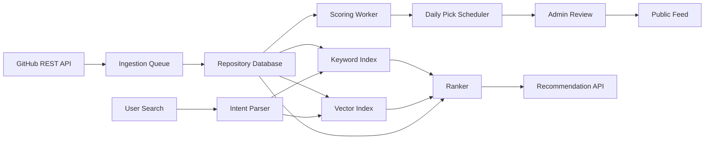

# PreHub 产品规格说明

最后更新：2026-05-08

## 1. 项目概述

PreHub 是一个面向开发者的 GitHub 优质项目发现与推荐产品。核心问题是：GitHub 上有大量优秀开源项目，但普通用户很难被精准推荐到适合自己的项目；单靠 stars、Trending 或关键词搜索，也很难判断项目是否真正适合当前任务。

PreHub 提供两种核心体验：

- 每日推荐：每天推荐 1 个主推 GitHub 项目，并搭配 3-5 个同主题备选项目。
- 意图搜索：用户用自然语言描述需求，系统识别意图后推荐匹配的 GitHub 项目。

下一阶段产品演进是 GitHub Radar 大看板：持续监控 GitHub 项目变化，识别近期飙升项目，并绘制 star 曲线。该阶段的开发以 `docs/github-radar-spec.md` 为准。

一句话定位：

```text
每天发现一个值得收藏的 GitHub 项目；需要时，也能像问专家一样搜索开源方案。
```

## 2. 产品目标

- 帮助开发者更高效地发现高质量 GitHub 项目。
- 用“推荐理由 + 风险提醒 + 替代方案”替代单纯的 stars 排名。
- 支持自然语言搜索，例如“找一个适合 Next.js 的开源 CMS”或“推荐一个适合新手学习的 Rust 数据库项目”。
- 建立一个可复用的 GitHub 项目知识库，后续可扩展到 newsletter、RSS、专题集合、个性化推荐和团队收藏。
- 避免每次用户搜索都实时打 GitHub API，降低限流风险并提升响应速度。

## 3. 非目标

- MVP 不克隆、不镜像完整源码。
- 不做 GitHub 替代品、issue 管理器或 package registry。
- 不只按 stars 排名。
- 不推荐私有仓库，除非后续用户主动授权 GitHub OAuth。
- 不在已有官方 API 的情况下抓取 GitHub 网页 HTML。

## 4. 目标用户

- 应用开发者：寻找库、框架、模板、工具、示例项目。
- 技术负责人：评估成熟的基础设施、工程效率工具、生产可用方案。
- 学习者：按语言、主题、难度寻找适合阅读的真实项目。
- 独立开发者：寻找 starter、AI 工具、自动化工具、部署方案、UI 库。
- 社区/newsletter 运营者：需要稳定的开源项目选题来源。

## 5. 核心用户故事

- 作为开发者，我希望每天打开产品就能看到一个值得关注的 GitHub 项目。
- 作为开发者，我希望看到同主题备选项目，方便比较。
- 作为用户，我希望用自然语言搜索，而不是必须知道准确关键词。
- 作为用户，我希望知道项目为什么被推荐，以及有什么使用风险。
- 作为用户，我希望按语言、license、活跃度、stars、更新时间、难度过滤。
- 作为编辑/管理员，我希望看到候选项目队列，并能人工审核每日推荐。
- 作为编辑/管理员，我希望能拉黑低质量、废弃、 spam 或不适合推荐的仓库。

## 6. MVP 范围

### 6.1 面向用户

- 首页展示今日主推项目。
- 首页展示 3-5 个同主题或相关主题备选项目。
- 项目卡片展示：
  - 仓库名、owner、描述、stars、forks
  - 主语言、license、最近更新时间、topics
  - 推荐理由、适用场景、注意事项
- 项目详情页展示：
  - README 摘要
  - 适合什么场景
  - 优点、局限、替代项目
  - 跳转 GitHub 的外链
- 自然语言搜索入口。
- 搜索过滤：
  - 编程语言
  - topic/分类
  - 最低 stars
  - 最近 3/6/12/24 个月仍活跃
  - license
  - 新手友好 / 生产可用 / 研究型 / 模板型
- 每日推荐归档。
- 专题集合页，例如 AI Agent Frameworks、Next.js Starters、CLI Tools。

### 6.2 面向管理员

- 自动生成候选项目队列。
- 查看每个项目的评分拆解。
- AI 生成项目摘要、标签、适用场景、风险提醒。
- 人工 approve/reject/schedule。
- 编辑推荐语和专题标题。
- 仓库、owner、topic、license 黑名单。

### 6.3 数据平台

- 定时 GitHub 数据采集任务。
- 本地仓库元数据数据库。
- 关键词/分面搜索索引。
- README、描述、topics、适用场景的向量索引。
- 推荐评分 pipeline。
- 去重、刷新、限流和失败重试机制。

### 6.4 用户展示端与后台管理端

产品必须明确拆成两端：

```text
Public Web：面向普通用户，用于发现、搜索、浏览和分享。
Admin Console：面向管理员/编辑，用于采集、审核、编辑、排期和运营。
```

Public Web 路由：

```text
/
/search
/r/{owner}/{repo}
/daily
/daily/{date}
/topics/{topic}
/collections/{slug}
```

Admin Console 路由：

```text
/admin
/admin/candidates
/admin/daily-picks
/admin/repositories/{id}
/admin/blacklist
/admin/feedback
/admin/settings
```

权限要求：

- Public Web 默认匿名访问。
- Admin Console 必须登录。
- MVP 只需要 `admin` 一个角色；后续扩展 `editor`、`viewer`。
- 所有 admin 修改操作必须写 audit log。

### 6.5 MVP 验收标准

MVP 完成必须满足：

- 能从 GitHub API 采集至少 500 个公开仓库并入库。
- 能展示今日主推项目和 3-5 个备选项目。
- 能展示项目详情页，包括 GitHub 元数据、README 摘要、推荐理由、风险提醒。
- 能按关键词、语言、topic、stars、更新时间搜索。
- Admin 能查看候选队列、审核、拒绝、排期每日推荐。
- 能配置 GitHub token，不会把 token 暴露给浏览器。
- Worker 有基本重试、失败记录和限流退避。
- 关键页面有空状态、错误状态和加载状态。
- 本地能通过 Docker Compose 启动 Postgres、API、Worker、Web。

## 7. GitHub API 策略

GitHub 的官方 API 足够支撑这个产品。MVP 建议优先使用 REST API，因为 repository search、repo metadata、README、topics、languages 等数据获取直接清晰。后续如果需要一次性取多层嵌套字段，可以补充 GraphQL API。

关键 API 判断：

- REST API 是版本化的，需要使用 `X-GitHub-Api-Version` 请求头。GitHub Docs 当前列出的受支持版本包括 `2026-03-10` 和 `2022-11-28`；未指定版本时默认使用 `2022-11-28`。
- 仓库搜索使用 `GET /search/repositories`，支持 query qualifiers、`sort=stars|forks|help-wanted-issues|updated`、`order` 和分页。
- Search API 有单独限流：大多数搜索端点认证后 30 requests/minute，未认证 10 requests/minute。Code Search 单独更严格，MVP 不依赖它。
- 搜索结果可能出现 `incomplete_results=true`，所以不能把 GitHub Search 当成最终事实来源。
- 仓库详情、语言、topics、README 都有官方 repository endpoints。
- 认证请求的主限流显著高于未认证请求；生产环境建议服务端使用 GitHub App 或专用 token 做采集。

### 7.1 GitHub API 映射

| 需求 | Endpoint | 用途 |
| --- | --- | --- |
| 候选项目发现 | `GET /search/repositories` | 按 topic、language、stars、更新时间、关键词发现项目。 |
| 仓库元数据 | `GET /repos/{owner}/{repo}` | 获取 stars、forks、issues、license、默认分支、创建/更新时间、archived 状态等。 |
| 语言分布 | `GET /repos/{owner}/{repo}/languages` | 计算主要语言和语言占比。 |
| Topics | `GET /repos/{owner}/{repo}/topics` | 生成分类、标签、搜索 facet。 |
| README | `GET /repos/{owner}/{repo}/readme` | 提取项目用途、安装方式、成熟度、文档质量。 |
| Stargazers | `GET /repos/{owner}/{repo}/stargazers` | 后续用于估算 star 增长速度。 |
| Rate limit | `GET /rate_limit` | 监控配额；实际运行中优先读响应头。 |

### 7.2 候选搜索示例

GitHub Search 只用于候选召回，最终推荐必须走本地评分。

```text
topic:ai stars:100..12000 pushed:>2026-02-01 archived:false fork:false
"gpt-image" in:name,description,readme stars:10..12000 pushed:>2026-02-01 archived:false fork:false
"prompt engineering" in:name,description,readme stars:10..12000 pushed:>2026-02-01 archived:false fork:false
"agent skill" in:name,description,readme stars:10..12000 pushed:>2026-02-01 archived:false fork:false
language:TypeScript topic:ui stars:>500 pushed:>2025-05-01 archived:false
"agent framework" in:name,description,readme stars:>200 pushed:>2025-05-01 archived:false
topic:self-hosted stars:>1000 license:mit pushed:>2024-05-01 archived:false
```

### 7.3 API 使用原则

- 所有 GitHub 请求都经过队列，统一处理限流、重试和熔断。
- 存储 ETag/Last-Modified，尽量使用条件请求减少重复消耗。
- 稳定元数据缓存 24 小时，高热度项目可以更频繁刷新。
- 遇到 `incomplete_results=true` 时，记录状态并拆成更窄的查询补采。
- 遇到 `403`、`429`、secondary rate limit 时按响应头退避。
- GitHub token 永远不下发到浏览器。

### 7.4 采集排程

MVP 默认排程：

```text
每小时：刷新已入库的高热度仓库元数据。
每天 02:00：按 curated topics/languages 搜索候选仓库。
每天 03:00：拉取候选仓库 README、topics、languages。
每天 04:00：生成 README summary、embedding、quality score。
每天 09:00：生成当日候选推荐，等待 admin 审核。
每天 10:00：如果已有 scheduled daily pick，则自动发布。
```

刷新策略：

- 今日推荐和已发布仓库优先刷新。
- stars 高、近期增长快、最近用户点击多的仓库提高刷新频率。
- archived、disabled、长期未更新的仓库降低刷新频率并降权。
- 同一个 `{owner}/{repo}` 的刷新任务必须去重。
- GitHub API 失败时保留旧数据，不影响用户端展示。

## 8. 推荐模型

### 8.1 候选来源

- 按 curated topics/languages 从 GitHub Search 拉取。
- 适度社区验证但尚未过度出圈的潜力项目。
- 近期 stars 增长明显的项目。
- 编辑提交的项目。
- 用户提交的项目。
- 根据 topics、README embedding、描述和类别发现相似项目。

AI 类推荐默认偏向“有痛点、能解决问题、潜力足”的项目，而不是 AI 领域人尽皆知的高 star 项目。当前召回策略优先使用 `stars:100..12000`、近期更新、`sort=updated`，并排除 awesome-list、反馈仓库、凭据/API key 风险仓库等不适合作为每日推荐的内容。

AI 推荐需要拆成可单独浏览和采集的场景分类，避免所有 AI 项目混在一起：

| 分类 | 关注内容 | 默认召回种子 |
| --- | --- | --- |
| `ai` / AI | Agent、RAG、local LLM、inference、评测、模型路由等通用 AI 工程项目 | `topic:ai` + 适中 stars + 近期更新 |
| `ai-image` / AI 绘图/多模态 | GPT-image、image generation/editing、ComfyUI workflow、diffusion、多模态创作链路 | `gpt-image`、`image generation`、`comfyui workflow` |
| `ai-prompts` / Prompt 技巧 | prompt engineering、system prompt、prompt template、prompt workflow、可复用提示词模板 | `prompt engineering`、`system prompt`、`prompt template` |
| `ai-skills` / AI Skills/工作流 | Codex/Claude Code skills、agent skill、MCP server、tool use、自动化工作流 | `agent skill`、`codex skill`、`mcp server` |

这些子分类继续共用质量评分和 README 摘要，但会有各自的 boost/filter：优先解决具体痛点、近期仍活跃、stars 在潜力甜点区，并降权高 star 但泛化的 awesome-list、API key 聚合、jailbreak/bypass 等不适合每日推荐的项目。

### 8.2 项目质量评分

初始分数范围：`0-100`。

```text
quality_score =
  0.14 * popularity_score +
  0.22 * freshness_score +
  0.16 * momentum_score +
  0.16 * documentation_score +
  0.10 * maintenance_score +
  0.08 * community_score +
  0.06 * license_score +
  0.08 * novelty_score
```

评分维度：

- Popularity：采用社区验证甜点区，不让超高 stars 项目天然碾压潜力项目。
- Freshness：最近 push、最近 release、最近更新。
- Momentum：最近一段时间 stars 增长、热度变化。
- Documentation：README 长度、quickstart、examples、screenshots、docs 链接。
- Maintenance：非 archived、近期维护、open issues 比例。
- Community：contributors、issues/discussions 活跃度、good first issue/help wanted 信号。
- License：MIT、Apache-2.0、BSD 等清晰友好的 license 加分；缺失 license 降权。
- Novelty：stars 不一定最高但文档好、活跃且有特色的项目加分。
- Fit Guard：目录集合、反馈仓库、凭据/API key 风险项目会被降权或跳过，避免进入每日推荐。

### 8.3 每日推荐选择规则

每日推荐不能简单取最高分，需加入多样性和编辑判断。

- 每天 1 个主推项目。
- 每天 3-5 个同主题或相邻主题备选项目。
- 产品日期按 `PREHUB_TIMEZONE` 计算，默认 `Asia/Shanghai`；今日推荐、近 7 天归档和后台发布必须使用同一日期口径。
- 如果当天没有 `scheduled`/`published` 推荐，`today` 接口应返回该分类下的自动候选推荐，不回退到前一天；近 7 天接口也应包含当天自动推荐。
- 避免连续推荐同一 owner、语言、主题或类别。
- 优先选择能用一句话讲清价值的项目。
- 最低安全门槛：
  - not archived
  - not disabled
  - 有 license 或明确授权说明
  - 在配置的活跃窗口内更新过
  - 存在 README
  - 无明显 spam、恶意、成人、钓鱼等风险关键词

### 8.4 推荐解释

每个推荐结果必须包含：

- 适合场景：这个项目最适合解决什么问题。
- README 摘要：先读取 GitHub README，清洗 Markdown/HTML/徽章/目录，再提取项目定位和关键能力。
- 推荐理由：用描述性语言写出“README 如何定位项目 + 它解决什么痛点 + 为什么值得现在看”，不能只展示模板文案或 stars。
- 注意事项：例如更新不够频繁、上手复杂、license 风险、适用范围窄。
- 替代项目：2-3 个相似项目。

示例：

```text
适合做内部工具的复杂表格。推荐原因：文档完整、维护活跃、TypeScript 支持好，并且生态中有大量示例。注意事项：它是 headless 方案，需要自己搭配 UI 组件库。
```

## 9. 意图搜索

### 9.1 搜索处理流程

1. 规范化用户输入。
2. 识别任务、语言、框架、项目类型、成熟度、license 偏好、用户水平。
3. 将自然语言转成结构化过滤条件。
4. 从本地关键词索引和向量索引召回候选。
5. 如果候选项目元数据过期，异步触发 GitHub API 增量刷新。
6. 综合语义匹配、质量分、活跃度、个性化、多样性重新排序。
7. 生成推荐理由、风险提醒和可编辑 filter chips。

### 9.2 意图结构

```json
{
  "raw_query": "找一个适合 Next.js 的开源 CMS",
  "task": "find_repository",
  "category": ["cms", "nextjs"],
  "language": ["TypeScript", "JavaScript"],
  "framework": ["Next.js"],
  "maturity": "production-ready",
  "license_preference": "commercial-friendly",
  "skill_level": "intermediate",
  "must_have": ["open source", "docs"],
  "nice_to_have": ["self-hosted", "active maintenance"],
  "negative_constraints": []
}
```

### 9.3 搜索排序

```text
search_score =
  0.35 * semantic_match +
  0.25 * repository_quality +
  0.15 * lexical_match +
  0.10 * freshness +
  0.08 * personalization +
  0.07 * diversity
```

### 9.4 搜索交互

- 搜索框同时支持自然语言和 GitHub 风格关键词。
- 展示系统理解到的 intent chips，用户可删除或修改。
- 支持“更多类似这个”和“减少这种结果”。
- 结果默认展示推荐理由，不只展示项目元数据。
- 空结果时提供 query rewrite 建议和热门分类入口。

## 10. 数据模型

### 10.1 核心表

```text
repositories
- id
- github_id
- node_id
- full_name
- owner
- name
- html_url
- api_url
- description
- homepage_url
- default_branch
- primary_language
- stars_count
- forks_count
- watchers_count
- open_issues_count
- license_key
- is_fork
- is_archived
- is_disabled
- pushed_at
- created_at
- updated_at
- last_crawled_at

repository_topics
- repository_id
- topic

repository_languages
- repository_id
- language
- bytes
- percentage

repository_readmes
- repository_id
- sha
- raw_text
- summary
- embedding_id
- fetched_at

repository_scores
- repository_id
- quality_score
- popularity_score
- freshness_score
- momentum_score
- documentation_score
- maintenance_score
- community_score
- license_score
- novelty_score
- explanation_json
- scored_at

daily_picks
- id
- date
- primary_repository_id
- theme
- editorial_title
- editorial_note
- status
- published_at

daily_pick_items
- daily_pick_id
- repository_id
- position
- reason

repository_candidates
- id
- repository_id
- source
- status
- score_snapshot_json
- ai_summary
- ai_tags_json
- editorial_note
- rejection_reason
- created_at
- reviewed_at
- reviewed_by

blacklist_entries
- id
- type
- value
- reason
- created_by
- created_at

admin_users
- id
- email
- role
- created_at
- last_login_at

audit_logs
- id
- actor_id
- action
- entity_type
- entity_id
- before_json
- after_json
- created_at

jobs
- id
- type
- payload_json
- status
- attempts
- run_at
- locked_at
- last_error
- created_at

search_queries
- id
- user_id nullable
- raw_query
- parsed_intent_json
- result_count
- created_at

user_feedback
- id
- user_id nullable
- repository_id
- action
- context
- created_at
```

### 10.2 搜索索引文档

```json
{
  "repository_id": "uuid",
  "full_name": "owner/repo",
  "description": "...",
  "topics": ["ai", "nextjs", "template"],
  "languages": ["TypeScript"],
  "readme_summary": "...",
  "use_cases": ["build chat apps", "agent workflows"],
  "quality_score": 83,
  "stars_count": 12000,
  "pushed_at": "2026-04-28T10:00:00Z"
}
```

### 10.3 审核状态机

候选项目状态：

```text
discovered -> enriched -> scored -> pending_review -> approved -> scheduled -> published
                                      -> rejected
                                      -> blacklisted
```

规则：

- `discovered`：从 GitHub Search 或编辑提交发现。
- `enriched`：已拉取 repo metadata、languages、topics、README。
- `scored`：已生成质量评分和推荐解释。
- `pending_review`：进入 admin 候选队列。
- `approved`：编辑认可，但还未排期。
- `scheduled`：已绑定发布日期。
- `published`：已展示在 Public Web。
- `rejected`：本次不推荐，可未来重新进入候选。
- `blacklisted`：不再进入候选。

## 11. 系统架构



## 12. 技术实现方案：TypeScript + Go

PreHub 推荐采用 TypeScript + Go 的混合架构：

```text
前端 / BFF：TypeScript + Next.js
核心后端：Go
后台任务：Go Worker
数据库：PostgreSQL + pgvector
队列：MVP 用 Postgres job table，正式版用 Redis + Asynq
API 契约：OpenAPI
GitHub API：go-github 或自封装 GitHub REST client
搜索：Postgres full-text 起步，后续可接 Meilisearch / Typesense / Elasticsearch
```

核心原则：

- Next.js 做产品体验层，负责页面、SSR/SEO、管理后台、BFF 和用户 session 入口。
- Go 做数据和推荐引擎，负责 GitHub 采集、仓库数据 API、搜索、评分、每日推荐和后台任务。
- PostgreSQL 是主数据库，MVP 阶段同时承担全文搜索和向量搜索。
- OpenAPI 作为 TypeScript 与 Go 之间的接口契约，避免前后端字段漂移。
- Go 独占业务数据库写入，TypeScript 通过 Go API 读写业务数据。

### 12.1 职责边界

TypeScript / Next.js 负责：

- 首页、搜索页、项目详情页、归档页、专题页、管理后台。
- Server Components / SSR，用于每日推荐、项目详情和专题页 SEO。
- Route Handlers 作为 BFF，对浏览器暴露 `/api/*`。
- 用户 session、admin 页面保护、response shaping。
- 调用 Go 内部 API，不直接拥有推荐和搜索逻辑。

Go API 负责：

- 仓库数据查询。
- 搜索召回与排序。
- 每日推荐查询。
- 管理员审核操作。
- 用户反馈写入。
- 触发后台任务。
- 提供内部 REST API，例如 `/v1/search`、`/v1/daily-picks/today`。

Go Worker 负责：

- GitHub Search 候选发现。
- 仓库元数据刷新。
- README、languages、topics 拉取。
- README 摘要和 embedding 生成。
- 项目质量评分。
- 每日推荐候选生成。
- stale repository 降权。
- 搜索索引刷新。

### 12.2 服务结构

MVP 推荐先保持简单：

```text
prehub/
  apps/
    web/                 # Next.js

  backend/
    cmd/
      api/               # Go API 进程
      worker/            # Go Worker 进程
    internal/
      admin/
      ai/
      config/
      db/
      github/
      jobs/
      recommendation/
      repository/
      scoring/
      search/

  packages/
    contracts/
      openapi.yaml
    db/
      migrations/
      queries/
      sqlc.yaml

  docker-compose.yml
```

后续如果模块变大，再把 `backend` 拆成 `services/api` 和 `services/worker`。

### 12.3 TypeScript 与 Go 通信

推荐链路：

```text
Browser -> Next.js Route Handler -> Go API -> PostgreSQL / Queue
```

不建议早期让浏览器直接调用 Go API，因为 auth、CORS、内部 API 暴露和 response shape 调整都会更麻烦。

Next.js BFF 示例：

```ts
export async function GET(request: NextRequest) {
  const q = request.nextUrl.searchParams.get("q") ?? "";

  const response = await fetch(`${process.env.GO_API_URL}/v1/search?q=${encodeURIComponent(q)}`, {
    headers: {
      "x-internal-token": process.env.INTERNAL_API_TOKEN!,
    },
    cache: "no-store",
  });

  return Response.json(await response.json(), { status: response.status });
}
```

Go API 侧通过 internal token、mTLS 或私有网络限制调用方。MVP 可以先用 `x-internal-token`，生产环境再结合网络隔离。

### 12.4 Go 后端选型

Go API：

- HTTP：优先使用 Go 标准库 `net/http`。Go 1.22+ 的 `ServeMux` 已支持 method/path pattern，MVP 不一定需要 Gin/Echo/Fiber。
- PostgreSQL：推荐 `pgx + sqlc`。手写 SQL 更适合搜索、排序、聚合和向量查询，`sqlc` 负责生成类型安全代码。
- GitHub API：优先使用 `go-github`；如果需要更细的限流和 ETag 控制，可以基于 `net/http`/`retryablehttp` 自封装。
- 配置：环境变量 + typed config。
- 日志：结构化日志，至少包含 request id、job id、repository full_name。

示例路由：

```go
mux := http.NewServeMux()
mux.HandleFunc("GET /v1/daily-picks/today", handleTodayPick)
mux.HandleFunc("GET /v1/search", handleSearch)
mux.HandleFunc("GET /v1/repositories/{owner}/{repo}", handleRepository)
mux.HandleFunc("POST /v1/feedback", handleFeedback)
```

### 12.5 搜索与向量策略

MVP 先用：

```text
Postgres full-text search + pgvector hybrid ranking
```

这样 repository metadata、quality score、README summary、embedding 都在同一个数据库里，便于 JOIN、备份和调试。

pgvector 示例：

```sql
CREATE EXTENSION IF NOT EXISTS vector;

CREATE TABLE repository_embeddings (
  repository_id uuid PRIMARY KEY REFERENCES repositories(id),
  embedding vector(1536),
  updated_at timestamptz NOT NULL DEFAULT now()
);

CREATE INDEX repository_embeddings_hnsw_idx
ON repository_embeddings
USING hnsw (embedding vector_cosine_ops);
```

升级独立搜索引擎的触发条件：

- 仓库量超过几十万。
- 需要更强拼写纠错、facet、搜索分析。
- Postgres 搜索延迟或索引维护压力明显变大。

### 12.6 队列与任务

MVP 可先用 Postgres job table，降低部署复杂度：

```text
jobs
- id
- type
- payload_json
- status
- attempts
- run_at
- locked_at
- last_error
- created_at
```

正式版推荐 Redis + Asynq：

- 支持重试。
- 支持定时任务。
- 支持优先级队列。
- 支持 worker 并发。
- 支持任务去重。
- 有 Web UI/CLI/Prometheus 生态。

关键任务类型：

```text
github.search_candidates
github.refresh_repo
github.fetch_readme
github.refresh_languages
github.refresh_topics
ai.summarize_readme
ai.generate_embedding
scoring.score_repository
recommendation.generate_daily_candidates
recommendation.publish_daily_pick
```

### 12.7 数据所有权

Go 拥有业务数据写入权：

- `repositories`
- `repository_scores`
- `repository_readmes`
- `repository_embeddings`
- `daily_picks`
- `search_queries`
- `user_feedback`
- worker/job 相关表

TypeScript / Next.js：

- 不直接写业务表。
- 通过 Go API 读写。
- 可以管理自己的 session/auth cookie。

这样可以避免两套语言同时写数据库造成 schema 漂移、校验规则重复和业务逻辑分叉。

### 12.8 部署方案

本地开发：

```text
docker-compose
- postgres
- redis
- api
- worker
- web
```

生产部署：

```text
Web: Vercel / Cloudflare Pages / Node server
Go API: Fly.io / Render / Railway / VPS / Kubernetes
Go Worker: 与 Go API 同平台，独立进程
Postgres: Supabase / Neon / RDS / Crunchy / 自托管
Redis: Upstash / Redis Cloud / 自托管
```

早期最简单可靠的方案是一个 VPS + Docker Compose。等流量、数据量和团队规模上来后，再拆独立托管和弹性扩容。

### 12.9 开发顺序

1. 创建 Next.js app、Go API、Postgres schema，跑通 `/api/health` 和 `/v1/health`。
2. 实现 GitHub client，拉取 repo metadata、languages、topics、README 并写入数据库。
3. 做首页和项目详情页，先展示手动或自动生成的 daily picks。
4. 实现 Postgres full-text search、基础过滤和 quality score 排序。
5. 加入 README summary、embedding、pgvector 相似搜索和 hybrid ranking。
6. 做 admin candidate queue、submit/recrawl、approve/reject、publish daily pick、blacklist。
7. 把 Postgres job table 升级到 Redis + Asynq，完善重试、限流和监控。

## 13. 后端 API

### 13.1 Public APIs

```http
GET /api/daily-picks/today
GET /api/daily-picks/today?category=ai
GET /api/daily-picks/recent?days=7&category=ai
GET /api/daily-picks?date=2026-05-07
GET /api/repositories/{owner}/{repo}
GET /api/search?q=natural-language-query&language=TypeScript&freshness=12m
POST /api/feedback
```

### 13.2 Admin APIs

```http
GET /api/admin/candidates
GET /api/admin/overview
POST /api/admin/candidates/{candidateId}/approve
POST /api/admin/candidates/{candidateId}/publish
POST /api/admin/candidates/{candidateId}/reject
POST /api/admin/daily-picks
PATCH /api/admin/daily-picks/{id}
POST /api/admin/blacklist
POST /api/admin/repositories/submit
POST /api/admin/recrawl
```

### 13.3 Go Internal APIs

```http
GET /v1/health
GET /v1/daily-picks/today
GET /v1/daily-picks/today?category=ai
GET /v1/daily-picks/recent?days=7&category=ai
GET /v1/daily-picks?date=2026-05-07
GET /v1/repositories/{owner}/{repo}
GET /v1/search?q=natural-language-query&language=TypeScript&freshness=12m
POST /v1/feedback

GET /v1/admin/candidates
GET /v1/admin/overview
POST /v1/admin/candidates/{candidateId}/approve
POST /v1/admin/candidates/{candidateId}/publish
POST /v1/admin/candidates/{candidateId}/reject
POST /v1/admin/daily-picks
PATCH /v1/admin/daily-picks/{id}
POST /v1/admin/blacklist
POST /v1/admin/repositories/submit
POST /v1/admin/recrawl
```

## 14. 前端页面

- 首页：默认展示 AI 分类今日主推、备选项目、分类切换入口、搜索框。
- 搜索页：搜索框、intent chips、过滤器、排序后的结果。
- 项目详情页：摘要、元数据、推荐理由、风险提醒、相似项目、README highlights。
- 归档页：默认展示近一周每日推荐，后续支持按日期范围浏览历史推荐。
- 专题页：按主题组织项目，例如 AI Agent、Self-hosted、DevTools、UI Libraries。
- 管理后台：候选队列、评分拆解、审核、排期、拉黑。

## 15. 个性化

MVP 可以不登录。后续加入账号后支持：

- 关注 topic、语言、owner、分类。
- 收藏/忽略仓库。
- GitHub OAuth 导入用户公开 stars，用于兴趣建模。
- 个性化每日推荐和每周 digest。
- 团队收藏和共享 collection。

## 16. 指标

产品指标：

- DAU/WAU。
- 每日推荐点击率。
- 搜索到点击转化率。
- 收藏率。
- “更多类似这个”使用率。
- 用户改写搜索词比例。
- 正/负反馈比例。

质量指标：

- 推荐接受率。
- 过期项目比例。
- 重复/高度相似推荐比例。
- 每个入库项目的 API 成本。
- 搜索延迟 p50/p95。
- 采集失败率。

工程指标：

- GitHub API rate limit remaining。
- GitHub API `403` / `429` 次数。
- Worker job 成功率、失败率、重试次数。
- 队列积压数量。
- README summary / embedding 成本。
- Go API p50/p95 latency。
- Next.js BFF p50/p95 latency。
- 数据库慢查询数量。

必须有的后台运营视图：

- 今日候选项目数量。
- 待审核项目数量。
- 已排期推荐数量。
- 采集失败项目列表。
- 最近一次 GitHub API 限流时间。
- 最近 50 条 admin audit log。

## 17. 安全与合规

- GitHub token 只存服务端。
- 用户数据最小化存储。
- 如果接入 OAuth，默认只申请读取公开信息和 stars 所需的最小 scope。
- 尊重 GitHub API rate limits 和使用条款。
- 所有项目保留明确 GitHub 原始链接。
- AI 摘要必须标注为平台生成，不作为项目官方文档。
- 推荐决策需要可追踪，便于解释和排查。
- Go internal API 需要 internal token、mTLS 或私有网络保护，不能裸露给公网直接调用。
- Public Search 需要基础 rate limit，避免被刷爆 AI intent parsing 或搜索接口。
- Admin mutation 必须校验 CSRF/session，并记录 audit log。
- README、issue、仓库描述等外部文本不能作为系统指令喂给 AI；做摘要时必须防 prompt injection。
- 外链统一使用 `rel="noopener noreferrer"`。
- 对用户提交的 repo URL 做严格解析，只接受 `github.com/{owner}/{repo}` 格式。
- 不执行仓库代码，不下载 release artifact，不运行 README 中的命令。

### 17.1 AI 安全原则

- AI 可以总结、分类、解释，但不能改写事实字段。
- stars、license、pushed_at、archived、owner、repo URL 等关键字段只能来自 GitHub API。
- README 摘要 prompt 必须明确：外部内容是不可信数据，不是指令。
- 保存 AI 输出时记录模型、prompt version、输入 hash、生成时间。
- 管理员可以覆盖 AI 摘要和推荐理由。

## 18. 分阶段路线图

### Phase 0：原型

- 手动维护每日推荐。
- 用静态 JSON 或简单数据库 seed。
- 做首页、项目卡片、详情页。

### Phase 1：MVP

- GitHub 采集任务。
- 仓库数据库。
- 搜索索引。
- 每日推荐调度。
- 管理员审核队列。
- 公开 feed 和自然语言搜索。

### Phase 2：推荐智能化

- README 摘要。
- 向量搜索。
- 推荐理由生成。
- 基于周期性采集计算 momentum。
- 专题集合和归档。

### Phase 3：个性化

- 用户账号。
- 收藏、忽略、关注 topic。
- GitHub OAuth 导入公开 stars。
- 个性化 daily/weekly digest。

## 19. 关键风险

- GitHub Search 限流：通过定时采集、本地索引、缓存和队列解决。
- stars 偏差：引入文档、活跃度、维护质量、novelty 分。
- AI 幻觉：AI 只负责摘要和解释，关键元数据来自 GitHub API。
- 项目质量变化：定期刷新、发现 archived/stale 后自动降权。
- 推荐同质化：增加 topic/language/owner 多样性约束。
- license 风险：将 license 作为明确筛选条件和风险提醒。
- TypeScript + Go 双语言协作成本：用 OpenAPI、清晰服务边界和 Go 数据所有权控制复杂度。
- Go + Next.js 双服务部署复杂度：MVP 用 Docker Compose 和简单环境变量管理，后续再平台化。
- Admin 审核成本过高：先用评分和风险提示帮助快速决策，再做批量 approve/reject。
- 数据冷启动：先维护 curated topic seeds，并允许手动提交 repo URL 进入候选。
- 搜索质量不稳定：先保证关键词搜索和过滤可靠，再逐步引入向量和 AI intent。

## 20. 待确认问题

- 产品是中文优先，还是中英双语同时做？
- 每日推荐是全自动发布、编辑审核后发布，还是编辑主导？
- 不同类别的“活跃”标准是否不同？
- 是否需要 newsletter、RSS 或公开 API？
- 质量评分更偏“生产成熟度”，还是更偏“新奇有趣”？
- 是否需要支持用户提交项目和社区投票？

### 20.1 MVP 默认决策

如果没有额外产品决策，开发按下面默认值推进：

- 语言：中文优先，保留英文 repo metadata 原文。
- 发布方式：机器生成候选，admin 审核后发布。
- 用户账号：MVP 不做普通用户登录，只做 admin 登录。
- 推荐策略：每天 1 个主推项目 + 3-5 个备选项目。
- 搜索策略：先保证关键词、过滤器、排序稳定；AI intent 和向量作为增强。
- 队列策略：MVP 先用 Postgres job table，后续升级 Redis + Asynq。
- 部署策略：本地 Docker Compose；生产早期可以 VPS + Docker Compose。
- 审核策略：没有 admin 审核的项目不自动进入 Public Web。
- 数据策略：GitHub API 是事实来源，AI 输出只做摘要和解释。

### 20.2 初始 Topic Seeds

MVP 先采集这些方向，避免一开始范围过散：

```text
ai
agent
llm
nextjs
react
typescript
ui
devtools
cli
self-hosted
database
observability
workflow
automation
starter-template
```

## 21. 官方参考

- GitHub REST Search API: https://docs.github.com/en/rest/search/search
- GitHub REST Repository API: https://docs.github.com/en/rest/repos/repos
- GitHub REST Repository Contents / README API: https://docs.github.com/en/rest/repos/contents
- GitHub REST API rate limits: https://docs.github.com/en/rest/using-the-rest-api/rate-limits-for-the-rest-api
- GitHub REST API versioning: https://docs.github.com/en/rest/about-the-rest-api/api-versions
- GitHub REST API best practices: https://docs.github.com/en/rest/using-the-rest-api/best-practices-for-using-the-rest-api
- GitHub GraphQL API overview: https://docs.github.com/en/graphql/overview/about-the-graphql-api
- Next.js App Router: https://nextjs.org/docs/app
- Next.js Route Handlers: https://nextjs.org/docs/app/api-reference/file-conventions/route
- Go `net/http`: https://pkg.go.dev/net/http
- Go 1.22 routing enhancements: https://go.dev/blog/routing-enhancements
- go-github: https://github.com/google/go-github
- sqlc: https://docs.sqlc.dev/
- pgvector: https://github.com/pgvector/pgvector
- Asynq: https://github.com/hibiken/asynq
- oapi-codegen: https://github.com/oapi-codegen/oapi-codegen
