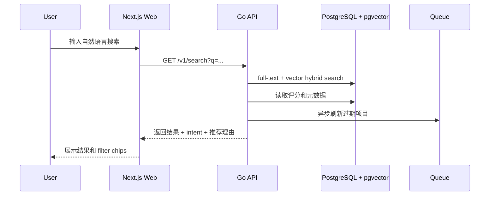
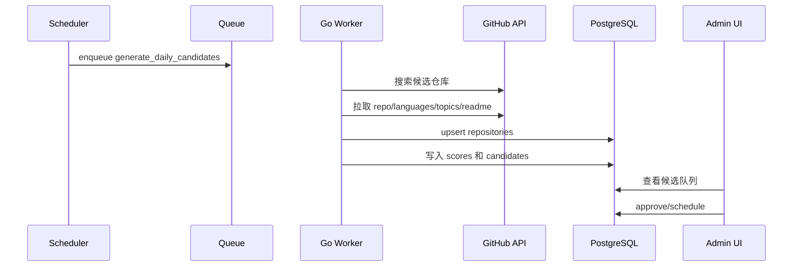

# PreHub TypeScript + Go 实现方案

最后更新：2026-05-07

## 1. 推荐结论

PreHub 推荐采用：

```text
前端 / BFF：TypeScript + Next.js
核心后端：Go
后台任务：Go Worker
数据库：PostgreSQL + pgvector
队列：Redis + Asynq，或早期先用 Postgres job table
API 契约：OpenAPI
GitHub API：go-github 或自封装 GitHub REST client
```

核心原则：

- TypeScript 负责页面、交互、SSR、BFF、少量聚合接口。
- Go 负责数据所有权、GitHub 采集、搜索、推荐、评分、后台任务。
- PostgreSQL 是主数据库，同时承担早期全文搜索和向量搜索。
- OpenAPI 作为 TypeScript 与 Go 之间的接口契约，避免前后端字段漂移。

一句话：

```text
Next.js 做产品体验，Go 做数据和推荐引擎。
```

## 2. 为什么这样拆

PreHub 的后端不是传统 CRUD 为主，而是包含大量后台流水线：

- GitHub 仓库搜索与采集。
- README 拉取、摘要、embedding。
- 项目评分。
- 每日推荐生成。
- 搜索召回与排序。
- 管理员审核。
- 用户反馈闭环。

这些任务大多是 I/O 密集型、定时型、批处理型。Go 的并发模型、部署方式和标准库 HTTP 能力很适合。TypeScript/Next.js 则更适合快速做产品 UI、SEO 页面、管理后台和用户交互。

## 3. 系统边界

### 3.1 TypeScript / Next.js 负责

- Web 页面：
  - 首页
  - 搜索页
  - 项目详情页
  - 每日归档页
  - 专题页
  - 管理后台
- SSR/SEO：
  - 每日推荐详情
  - 项目详情页
  - 专题页
- BFF：
  - 统一调用 Go API
  - 处理用户 session
  - 保护 admin 页面
  - 必要时做 response shaping
- 轻量 Route Handlers：
  - `/api/search`
  - `/api/daily-picks/today`
  - `/api/repositories/[owner]/[repo]`
  - `/api/feedback`
  - `/api/admin/*`

Next.js 的 Route Handlers 用于对浏览器暴露稳定接口，但不直接拥有核心数据逻辑。

### 3.2 Go API 负责

- 仓库数据查询。
- 搜索召回与排序。
- 每日推荐查询。
- 管理员审核操作。
- 用户反馈写入。
- 触发后台任务。
- 对外提供内部 REST API。

Go API 是数据和业务规则的 owner。

### 3.3 Go Worker 负责

- GitHub Search 候选发现。
- 仓库元数据刷新。
- README 拉取。
- README 摘要。
- embedding 生成。
- 项目质量评分。
- 每日推荐候选生成。
- stale repository 降权。
- 搜索索引刷新。

Worker 与 API 可以共用同一个 Go module，但运行成两个进程。

## 4. 请求链路

### 4.1 用户搜索



### 4.2 每日推荐生成



## 5. 推荐仓库结构

```text
prehub/
  apps/
    web/
      app/
      components/
      lib/
      generated/
      package.json

  services/
    api/
      cmd/api/
      internal/http/
      internal/search/
      internal/recommendation/
      internal/repository/
      internal/admin/
      internal/config/
      go.mod

    worker/
      cmd/worker/
      internal/jobs/
      internal/github/
      internal/scoring/
      internal/ai/
      internal/embedding/
      go.mod

  packages/
    contracts/
      openapi.yaml

    db/
      migrations/
      queries/
      sqlc.yaml

  docker-compose.yml
  README.md
```

也可以先简化成一个 Go module：

```text
backend/
  cmd/api/
  cmd/worker/
  internal/...
```

MVP 先用简化结构更快。

## 6. 后端技术选型

### 6.1 Go HTTP

优先用 Go 标准库 `net/http`。Go 1.22 之后 `ServeMux` 支持 method matching 和 wildcard path，早期 API 不一定需要 Gin/Echo/Fiber。

示例：

```go
mux := http.NewServeMux()
mux.HandleFunc("GET /v1/daily-picks/today", handleTodayPick)
mux.HandleFunc("GET /v1/search", handleSearch)
mux.HandleFunc("GET /v1/repositories/{owner}/{repo}", handleRepository)
mux.HandleFunc("POST /v1/feedback", handleFeedback)
```

如果后续需要复杂 middleware、route group、OpenAPI validation，再考虑 chi 或 oapi-codegen 的 net/http middleware。

### 6.2 PostgreSQL 访问

推荐：

```text
pgx + sqlc
```

原因：

- `pgx` 是成熟 PostgreSQL driver/toolkit。
- `sqlc` 从 SQL 生成类型安全 Go 代码。
- 这个项目会有比较多搜索、排序、聚合、向量查询，手写 SQL 比 ORM 更清晰。

### 6.3 向量搜索

MVP 使用 pgvector，直接把 embedding 存在 PostgreSQL：

```sql
CREATE EXTENSION IF NOT EXISTS vector;

CREATE TABLE repository_embeddings (
  repository_id uuid PRIMARY KEY REFERENCES repositories(id),
  embedding vector(1536),
  updated_at timestamptz NOT NULL DEFAULT now()
);

CREATE INDEX repository_embeddings_hnsw_idx
ON repository_embeddings
USING hnsw (embedding vector_cosine_ops);
```

早期优势：

- 少一个独立向量数据库。
- repository metadata、score、embedding 可以 JOIN。
- 备份、事务、权限都跟 Postgres 一起管理。

后续数据量变大，再迁移到 Qdrant/Milvus/独立向量服务。

### 6.4 搜索

MVP：

```text
Postgres full-text search + pgvector hybrid ranking
```

后续：

```text
Meilisearch / Typesense / Elasticsearch
```

触发升级的信号：

- 仓库量超过几十万。
- 拼写纠错、复杂 facet、搜索分析需求明显增加。
- Postgres 搜索延迟或索引维护压力变大。

### 6.5 队列与定时任务

推荐两档方案：

#### MVP 简化版

用 Postgres job table：

```text
jobs
- id
- type
- payload_json
- status
- attempts
- run_at
- locked_at
- last_error
- created_at
```

优点：少部署 Redis，适合原型。

缺点：高级重试、优先级、监控要自己做。

#### 正式版

用 Redis + Asynq：

- 支持重试。
- 支持定时任务。
- 支持优先级队列。
- 支持 worker 并发。
- 支持任务去重。
- 有 Web UI/CLI/Prometheus 生态。

注意：Asynq 目前仍是 `v0.x`，公共 API 可能变化。生产可用但要锁定版本。

## 7. TypeScript 与 Go 如何通信

推荐使用 OpenAPI：

```text
packages/contracts/openapi.yaml
```

生成：

- Go server types：`oapi-codegen`
- TypeScript client/types：`openapi-typescript` 或 OpenAPI Generator

调用方式：

```text
Browser -> Next.js Route Handler -> Go API
```

不建议早期让浏览器直接调用 Go API，因为：

- auth/session 处理更麻烦。
- CORS 更麻烦。
- 内部 API 地址暴露。
- 以后 response shape 调整不方便。

Next.js BFF 示例：

```ts
export async function GET(request: NextRequest) {
  const q = request.nextUrl.searchParams.get("q") ?? "";

  const response = await fetch(`${process.env.GO_API_URL}/v1/search?q=${encodeURIComponent(q)}`, {
    headers: {
      "x-internal-token": process.env.INTERNAL_API_TOKEN!,
    },
    cache: "no-store",
  });

  return Response.json(await response.json(), { status: response.status });
}
```

Go API 校验：

```go
func internalAuth(next http.Handler) http.Handler {
	return http.HandlerFunc(func(w http.ResponseWriter, r *http.Request) {
		if r.Header.Get("x-internal-token") != os.Getenv("INTERNAL_API_TOKEN") {
			http.Error(w, "unauthorized", http.StatusUnauthorized)
			return
		}
		next.ServeHTTP(w, r)
	})
}
```

## 8. API 草案

Go API：

```http
GET /v1/daily-picks/today?category=ai
GET /v1/daily-picks/recent?days=7&category=ai
GET /v1/daily-picks?date=2026-05-07
GET /v1/repositories/{owner}/{repo}
GET /v1/search?q=...
POST /v1/feedback

GET /v1/admin/candidates
POST /v1/admin/candidates/{candidateId}/approve
POST /v1/admin/candidates/{candidateId}/publish
POST /v1/admin/candidates/{candidateId}/reject
POST /v1/admin/daily-picks
PATCH /v1/admin/daily-picks/{id}
POST /v1/admin/repositories/submit
POST /v1/admin/recrawl
```

Next.js 对外 BFF：

```http
GET /api/daily-picks/today?category=ai
GET /api/daily-picks/recent?days=7&category=ai
GET /api/search?q=...
GET /api/repositories/{owner}/{repo}
POST /api/feedback
GET /api/admin/candidates
POST /api/admin/candidates/{candidateId}/approve
POST /api/admin/candidates/{candidateId}/publish
POST /api/admin/repositories/submit
POST /api/admin/recrawl
```

## 9. 数据所有权

建议 Go 独占数据库写入。

TypeScript/Next.js：

- 不直接写业务表。
- 通过 Go API 读写。
- 可以管理自己的 session/auth cookie。

Go：

- 拥有 migrations。
- 拥有 repository/search/recommendation 数据。
- 拥有 admin mutation。
- 拥有 worker 状态和任务写入。

这样能避免双语言同时写数据库带来的 schema 漂移。

## 10. 部署方案

### 10.1 本地开发

```text
docker-compose
- postgres
- redis
- api
- worker
- web
```

开发命令：

```text
apps/web: npm run dev
services/api: go run ./cmd/api
services/worker: go run ./cmd/worker
```

### 10.2 生产部署

推荐：

```text
Web: Vercel / Cloudflare Pages / Node server
Go API: Fly.io / Render / Railway / Kubernetes / VPS
Go Worker: 同 Go API 平台，独立进程
Postgres: Supabase / Neon / RDS / Crunchy / 自托管
Redis: Upstash / Redis Cloud / 自托管
```

如果追求简单：

```text
一个 VPS + Docker Compose
```

早期产品这样非常够用，后续再拆。

## 11. 关键任务设计

### 11.1 GitHub 采集任务

任务类型：

```text
github.search_candidates
github.refresh_repo
github.fetch_readme
github.refresh_languages
github.refresh_topics
```

原则：

- 所有请求带 GitHub API version header。
- 统一处理 ETag。
- 统一处理 rate limit。
- 失败任务指数退避。
- 同一个 repo 的刷新任务去重。

### 11.2 AI 任务

任务类型：

```text
ai.summarize_readme
ai.generate_embedding
ai.parse_intent
ai.generate_recommendation_reason
```

建议：

- 搜索请求里的 intent parsing 可以同步执行，但要有超时。
- README 摘要和 embedding 走异步任务。
- AI 结果必须落库，避免重复调用。

### 11.3 推荐任务

任务类型：

```text
scoring.score_repository
recommendation.generate_daily_candidates
recommendation.publish_daily_pick
```

评分逻辑必须纯函数化，方便测试：

```go
func ScoreRepository(input ScoreInput) ScoreBreakdown
```

## 12. 开发顺序

### Step 1：基础骨架

- 创建 Next.js app。
- 创建 Go API。
- 创建 Postgres schema。
- 跑通 `/v1/health` 和 `/api/health`。

### Step 2：GitHub 采集

- 实现 GitHub client。
- 实现 repo search。
- 实现 repo metadata/languages/topics/readme 拉取。
- 写入 repositories 表。

### Step 3：首页

- 手动或自动生成 daily_picks。
- Next.js 首页展示今日推荐。
- 项目详情页展示元数据。

### Step 4：搜索

- 实现 Postgres full-text search。
- 加入基础过滤条件。
- 加入排序和 quality_score。

### Step 5：AI 与向量

- README summary。
- embedding。
- pgvector 相似搜索。
- hybrid ranking。

### Step 6：后台管理

- admin candidate queue。
- approve/reject/schedule。
- blacklist。

## 13. 早期不要做的事

- 不要一开始拆微服务。
- 不要一开始上 Kubernetes。
- 不要一开始做独立搜索集群。
- 不要 TypeScript 和 Go 同时直接写业务数据库。
- 不要让用户搜索实时依赖 GitHub Search API。
- 不要把 AI 输出当作可信事实，关键元数据必须来自 GitHub API。

## 14. 主要风险

- 两套语言带来协作成本：用 OpenAPI 和清晰边界解决。
- Go + Next.js 双服务部署复杂：早期用 Docker Compose，生产也可以同机部署。
- 搜索质量早期不稳定：先做可解释排序，再引入 embedding。
- GitHub API 限流：定时采集、本地索引、ETag、队列退避。
- Asynq v0.x API 风险：锁版本；或早期先用 Postgres job table。

## 15. 官方参考

- Next.js App Router: https://nextjs.org/docs/app
- Next.js Route Handlers: https://nextjs.org/docs/app/api-reference/file-conventions/route
- Go `net/http`: https://pkg.go.dev/net/http
- Go 1.22 routing enhancements: https://go.dev/blog/routing-enhancements
- go-github: https://github.com/google/go-github
- sqlc: https://docs.sqlc.dev/
- pgvector: https://github.com/pgvector/pgvector
- Asynq: https://github.com/hibiken/asynq
- oapi-codegen: https://github.com/oapi-codegen/oapi-codegen
